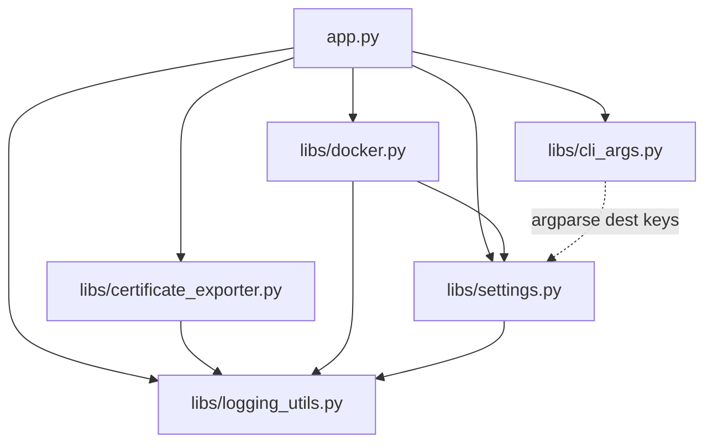

# Architecture Spine — traefik-certificate-exporter

Brownfield: ratifies the existing, already-shipped codebase (v0.1.3) rather than proposing a
new design. Every AD below states what the code already does (or, where marked, what a
tracked fix will make it do) — none of these are greenfield proposals.

## Design Paradigm

Layered, single process, no service boundaries:

- **Entrypoint / orchestration** — `src/traefik_certificate_exporter/app.py`: wires config,
  logging, the file watcher, and the two side-effect handlers (export, Docker restart)
  together; owns the run loop.
- **Domain logic** — `libs/certificate_exporter.py` (`AcmeCertificateExporter`,
  `PemToPfxConverter`): ACME JSON parsing (v1/v2), PEM/PKCS12 generation. Pure with respect
  to its inputs; the only I/O is the export write itself.
- **Adapters** — `libs/settings.py` (config sources: CLI/file/env via `confuse`),
  `libs/docker.py` (Docker Engine API client), `libs/logging_utils.py` (logging
  configuration), `libs/cli_args.py` (`argparse` surface).

No network service boundary exists inside the process — everything above is in-process
Python calls. The only external boundaries are the filesystem (data/output paths) and,
optionally, the Docker socket.

## Invariants & Rules



### AD-1 — Poetry is the single dependency source

- **Binds:** all
- **Prevents:** ad-hoc `pip install`, hand-maintained `requirements.txt`, or any parallel
  dependency list diverging from what's actually locked
- **Rule:** `pyproject.toml` + committed `poetry.lock` are the only declaration of runtime
  and dev dependencies. No other file (Dockerfile, CI script) may hand-list a package set —
  it must derive from the lock (see AD-4). [ADOPTED] — `docs/adr/0001`.

### AD-2 — Container base image and privilege model

- **Binds:** `docker/Dockerfile`, deployment
- **Prevents:** reinventing a bespoke container init/permission scheme
- **Rule:** base on the `linuxserver.io` Alpine image family (s6-overlay init, PUID/PGID
  privilege drop at runtime); pin `FROM` by digest; stay on a currently-supported release
  (tracked fix: PRD backlog #13/Epic 2 Story 2.3 — `3.19` is EOL). [ADOPTED] — `docs/adr/0002`.

### AD-3 — Logging: structured file output, secrets never logged

- **Binds:** every logging call site
- **Prevents:** secrets (PKCS12 passphrase, any future secret-shaped field) appearing in
  logs at any level; unstructured, unparseable file logs
- **Rule:** any field matching a secret allowlist is redacted before serialization, at every
  log level, with no exception; file-handler output is structured (JSON); console output may
  stay human-readable. No cross-process correlation ID — single-process tool, nothing to
  correlate across. (Tracked fix: PRD backlog #1 and #9 / Epic 1 Story 1.1, Epic 4 Story
  4.2 — not yet implemented as of this spine.) — `docs/adr/0003`.

### AD-4 — Docker image built from the locked dependency set

- **Binds:** `docker/Dockerfile`, `pyproject.toml`, `poetry.lock`
- **Prevents:** the image's installed package set silently diverging from the published
  package's declared dependencies (already happened once: `pyOpenSSL` added to the image,
  never declared in `pyproject.toml`)
- **Rule:** the image's Python dependency set is derived mechanically via a multi-stage
  `poetry install --only main` build stage (never `poetry export` — since Poetry 2.0 that
  requires the separate `poetry-plugin-export` plugin for no offsetting benefit; verified
  against `python-poetry.org` 2026-08-30) — never a separately hand-maintained list.
  (Tracked fix: PRD backlog #8 / Epic 2 Story 2.2 — not yet implemented as of this spine.)
  — `docs/adr/0004`.

### AD-5 — One CI pipeline, three runners, no `ACT` branching

- **Binds:** `.github/workflows/*`
- **Prevents:** a workflow that looks like it orchestrates a release but cannot execute
  (the current `build.yaml` bug); pipeline behavior diverging between GitHub Actions, Gitea
  Actions, and local `nektos/act`
- **Rule:** reusable-workflow composition is job-level `uses:` against
  `.github/workflows/*.yaml`, never step-level references to a nonexistent custom-actions
  path. No step may branch on the `ACT` environment variable, under any circumstances.
  (Tracked fix: PRD backlog #4/#11 / Epic 2 Stories 2.4, 2.5 — not yet implemented.) —
  `docs/adr/0005`.

## Consistency Conventions

| Concern | Convention |
| --- | --- |
| Naming (config, files) | Lowercase-dotted config keys (`settings.datapath`); CLI flags map via `argparse` `dest=` to the same dotted keys; env vars use the `TRAEFIK_CERTIFICATE_EXPORTER_` prefix with `_` as the `confuse` separator |
| Data & formats | Both Traefik ACME v1 (`DomainsCertificate.Certs`) and v2 (`Certificates`, `lowercase`/`uppercase` key variants) are parsed; every export always produces both PEM (key/cert/chain/fullchain) and PKCS12 |
| State & cross-cutting | Config precedence: CLI > env var > config file > packaged default (via `confuse`) — env vars deliberately outrank the config file, matching this project's Docker-first deployment model; global singletons (`globalLogger`, `globalArgs`, `globalSettingsMgr`) hold cross-cutting concerns; secrets never logged (AD-3) |

## Stack

| Name | Version |
| --- | --- |
| Python | `^3.10` (per `pyproject.toml`) |
| Poetry | dependency/build tool (AD-1) |
| watchdog | `^2.1.9` — filesystem event watching |
| docker (SDK) | `^6.0.0` — Docker Engine API client |
| confuse | `^2.0.1` — layered config (CLI/file/env) |
| cryptography | not yet declared — tracked fix, PRD backlog #3 / Epic 2 Story 2.1 |
| coloredlogs | `^15.0.1` — console log formatting |
| `ghcr.io/linuxserver/baseimage-alpine` | `:3.19` — EOL; tracked upgrade, PRD backlog #13 / Epic 2 Story 2.3 |

## Structural Seed

```text
src/traefik_certificate_exporter/
  app.py                    # entrypoint: wires config, logging, watcher, side effects
  config_default.yaml       # packaged default settings
  logging.yaml              # logging.config.dictConfig source
  libs/
    cli_args.py             # argparse surface -> confuse dotted keys
    settings.py             # Settings + SettingsManager (confuse-backed)
    certificate_exporter.py # AcmeCertificateExporter, PemToPfxConverter (domain logic)
    docker.py                # DockerManager (Docker Engine API adapter)
    logging_utils.py        # setup_logging(), globalLogger
    object.py                # ObjectBase: simple pub/sub used by SettingsManager
docker/
  Dockerfile                 # linuxserver.io Alpine base + s6-overlay (AD-2)
  root/etc/s6-overlay/...    # s6 init scripts (config seeding, service run)
tests/                       # currently empty -- tracked fix, PRD backlog #5 / Epic 1 Story 1.3
```

## Capability → Architecture Map

| Capability / Area | Lives in | Governed by |
| --- | --- | --- |
| FR1 (ACME parsing) | `libs/certificate_exporter.py` | Design Paradigm (domain logic) |
| FR2 (multi-format export) | `libs/certificate_exporter.py` | Design Paradigm |
| FR3 (layout modes) | `libs/certificate_exporter.py` | Consistency Conventions (data & formats) |
| FR4 (domain include/exclude) | `libs/settings.py`, `libs/cli_args.py` | Consistency Conventions (naming); tracked fix Epic 3 Story 3.1 |
| FR5 (resolver scoping) | `libs/certificate_exporter.py` | Design Paradigm |
| FR6 (run-once/watch) | `app.py` | Design Paradigm (orchestration) |
| FR7 (event debounce) | `app.py` (`AcmeCertificateFileHandler`) | Design Paradigm |
| FR8 (Docker restart) | `libs/docker.py` | Design Paradigm (adapters) |
| FR9 (dry-run) | `libs/settings.py`, `libs/certificate_exporter.py` | Consistency Conventions |
| FR10 (CLI/file/env config) | `libs/settings.py`, `libs/cli_args.py` | Consistency Conventions (naming, precedence) |
| FR11 (PyPI + Docker distribution) | `pyproject.toml`, `docker/Dockerfile` | AD-1, AD-2, AD-4 |
| NFR1 (no secret leakage) | `libs/settings.py` (`_dump_settings`/`_dump_config`) | AD-3 |
| NFR2 (loud misconfiguration failure) | `libs/settings.py`, `app.py` | tracked fix Epic 1 Story 1.2 |
| NFR3 (no missing transitive deps) | `pyproject.toml` | AD-1; tracked fix Epic 2 Story 2.1 |
| NFR4 (CI builds/publishes reliably) | `.github/workflows/*` | AD-5; tracked fix Epic 2 Stories 2.4/2.5 |
| NFR5 (regression test suite) | `tests/` | tracked fix Epic 1 Story 1.3 |
| NFR6 (structured logs) | `libs/logging_utils.py`, `logging.yaml` | AD-3; tracked fix Epic 4 Story 4.2 |
| NFR7 (working first-run config) | `docker/root/etc/s6-overlay/...` | tracked fix Epic 4 Story 4.1 |

## Deferred

- **Observability/metrics surface** (PRD backlog #21) — no health/metrics endpoint exists or
  is committed to; explicitly requires stakeholder validation before it becomes an AD.
- **Kubernetes-native deployment mode** — out of scope per the PRD (§5); Docker-socket-only
  today. Revisit if that scope ever changes.
- **Post-export hook implementation shape** (Epic 5 Story 5.1) — the *capability* to run a
  configurable command after export is a validated requirement, but its exact interface
  (env var vs. argument passing, timeout value) is a story-level decision, not an
  architectural invariant.
- **Cross-process correlation ID** — deliberately deferred, not merely postponed: revisit
  only if a future change adds a network-facing component (e.g. the deferred metrics
  surface), per AD-3's own reasoning.
