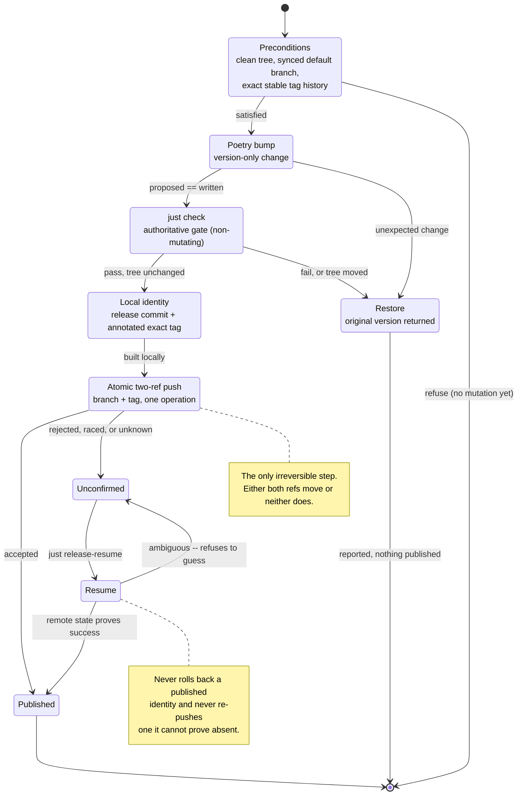

# ADR-0006: Committed Poetry version and atomic release identity

- **Status:** Accepted
- **Date:** 2026-08-31
- **Deciders:** Maintainer (ravensorb)
- **Principle(s) in tension:** Simple local release preparation, complete remote identity, and recoverability under concurrent publication
- **Amended:** 2026-09-01 — made the *sole* version authority; `release.yaml` retired, and the
  identity/artifacts boundary drawn (see the two amendments below)

## Context

The previous `scripts/git-increment-version.sh` derived a version independently of Poetry, created
a tag without a matching committed package-version change, and used `git push --tags origin main`.
That broad, non-atomic operation could publish unrelated tags or update only one half of the release
identity. A retry after a partial or uncertain failure had no narrow state contract.

The project already commits its package version in `pyproject.toml`, with dynamic versioning
disabled. The release mechanism therefore needs to preserve Poetry as the version authority while
making the version commit and exact tag one indivisible remote publication.

## Options considered

| Option | Benefits | Costs and risks |
|---|---|---|
| Keep a tag-only shell helper | Small and familiar | Duplicates version logic, can drift from package metadata, and cannot safely publish two refs |
| Let CI infer a version dynamically | Avoids a preparation commit | Conflicts with the committed-version packaging contract and makes local artifacts differ from release identity |
| Guard a Poetry version commit and publish its exact annotated tag atomically | One version authority, inspectable local state, and all-or-nothing remote refs | Requires Git servers that support atomic push and explicit recovery validation |

## Decision

Use `scripts/release_version.py` as the sole release transaction and retire the broad shell path.
The following are invariants:

1. Only `major`, `minor`, and `patch` are accepted. Poetry calculates and writes the version; no
   second version file or TOML version parser exists.
2. Preparation starts from a clean checkout of the remote's advertised default branch, with equal
   local/remote tips, complete equal exact-stable-tag histories, and a greatest tag matching the
   committed Poetry version. These checks query the remote without fetching so a failed
   precondition does not mutate local refs.
3. The changed working tree is validated by the authoritative `just check` command. Failure invokes
   Poetry to restore the original version and verifies a clean tree before stopping.
4. A successful gate creates one predictable version commit and one annotated exact
   `vMAJOR.MINOR.PATCH` tag that peels to that commit. Preparation without publication prints the
   exact push rather than executing it.
5. Publication refetches and revalidates the remote parent, tag absence, local commit, committed
   version, and tag immediately before one command:

   ```text
   git push --atomic origin HEAD:<default-branch> refs/tags/vMAJOR.MINOR.PATCH
   ```

   Broad refspecs, `--tags`, force, separate pushes, destructive rollback, and non-atomic fallback
   are prohibited **in this transaction**. That scope is deliberate and is not a blanket ban on
   forced writes anywhere in the project — see "Alias tags move, and moving one is a forced write"
   below.
6. A failed push preserves the local commit and tag. Resume accepts only one direct unpushed release
   commit, exactly one matching annotated tag, an equal Poetry version, the unchanged remote parent,
   and an absent remote exact tag. It repeats the existing atomic push without bumping, committing,
   or retagging.

The root `justfile` remains a thin, credential-free facade for dry-run, guarded publication, and
resume. It contains no version calculation.

## Sole authority (amendment, 2026-09-01)

This transaction is the **only** mechanism permitted to move version identity.

`.github/workflows/release.yaml` ran `googleapis/release-please-action@v5` on every push to
`main` with `contents: write` and `release-type: python`, claiming the same identity this ADR
governs. Nothing arbitrated between them, and the collision had already occurred in this
repository's history: `f23f561` ("Change version to", a malformed bot commit) followed by
`ce61e05` ("fix: revert bot-corrupted version"). `build.yaml` carried its own comment recording
that the publication path "previously corrupted `pyproject.toml`'s version".

The competing mechanism was also not working. The CI/CD architecture review of 2026-08-31
records release-please failing on **every** run with `Fetching pyproject.toml … ✖ invalid
file`: its `python` strategy cannot parse this project's Poetry-legacy `pyproject.toml`, which
declares no PEP 621 `[project]` table, and it looks for `version.py` where this repository has
`_version.py`. The same review notes it is GitHub-API-only and cannot run against Gitea,
contradicting the project's one-pipeline/three-runners goal. The choice was not between two
working release paths; it was between a working one and a broken one that could still corrupt
state.

**Decision:** `release.yaml` is deleted. Releases are prepared and published only by
`scripts/release_version.py` via `just release`, run by a maintainer holding their own
credentials.

## Identity versus artifacts of an identity (amendment, 2026-09-01)

"Sole authority" was initially read as "no workflow may ever hold `contents: write`", which
would make a forge Release impossible to create. That reading is too broad.

**GitHub has no `releases:` permission scope.** Its documentation places release creation
inside `contents`: "`contents: read` permits an action to list the commits, and
`contents: write` allows the action to create a release." So any release automation needs it.

What this ADR owns is who **chooses** the version, not who attaches objects to a version
already chosen:

| Concern | Owner | Rationale |
|---|---|---|
| The committed Poetry version, and the exact `vX.Y.Z` annotated tag | **Local guarded transaction only** | This *is* the identity. Two writers cannot be reconciled — that is what corrupted `pyproject.toml` before. |
| The forge Release object, its assets, and the moving `vMAJOR`/`vMAJOR.MINOR` aliases | **A single registered CI finalizer job** | These attach to, or point at, an identity the transaction already decided and published. An alias is a pointer, not a choice. |

Package and image publication need none of this: PyPI/TestPyPI use registry credentials or
`id-token: write`, and GHCR/Docker Hub use `packages: write` plus a registry login. Only the
Release and the Git aliases touch `contents`.

**Enforcement is two guards, because one cannot cover it.**

- `test_no_workflow_holds_github_token_write_access_to_contents` — no workflow or job may
  declare `contents: write` unless its job name is registered in `RELEASE_FINALIZER_JOBS`.
- `test_no_workflow_writes_refs_or_releases_outside_a_finalizer` — no unregistered job may run
  `git push`, `gh release create/upload/edit/delete`, `gh api …/releases`, or a
  release-creating action.

The second exists because the first is structurally blind to the case that matters most. The
`permissions:` key configures **only** the automatic `GITHUB_TOKEN` — GitHub's wording is
"modify permissions for the `GITHUB_TOKEN`" — so a job pushing with a PAT, GitHub App token or
deploy key from `secrets` never trips it. Verified by planting a `git push origin
HEAD:refs/tags/v9.9.9` step with the permissions block untouched: the permissions check passed,
the behavioural check failed.

`RELEASE_FINALIZER_JOBS` is deliberately a hand-kept list rather than a derived scope: it is a
registry of granted exceptions, and adding a name to it *is* the grant. Per gate finding F6 it
holds `(workflow filename, job name)` **pairs**, because a bare name matches across every
workflow and Epic 8 creates a finalizer in both `dev.yaml` and `release.yaml`.

Story E008-S01-003 filled it with three entries: `("release.yaml", "finalize")`, which creates
the Release and moves the Git aliases and is the only job in the repository declaring
`contents: write`; `("release.yaml", "finalize-image-aliases")`; and
`("dev.yaml", "finalize-dev-alias")`. The last two write no ref -- they are registered because
they move a *registry* alias, and `test_only_registered_finalizers_move_an_alias` asserts that
the set of alias-moving jobs, derived from the parsed steps, **equals** this registry. Every
finalizer depends transitively on the governed verifier, so nothing is released or aliased that
was not first verified.

## The transaction as a state machine

Two phases. Everything up to the atomic push is local and fully reversible; the push is the
single irreversible step, and everything after it is confirmation rather than mutation.



The `Restore` path is why the preconditions are strict: every failure before the push returns
the working tree to the version it started from, so a failed release leaves no partial identity
behind. The `Unconfirmed` state is deliberately terminal until a human runs the resume — an
automatic retry could double-publish, and an automatic rollback could delete a tag other
machines have already fetched.


## Alias tags move, and moving one is a forced write (amendment, 2026-09-02)

**Requirement, not a trade-off: once a valid release exists, the major alias floats.** `vMAJOR`
and `vMAJOR.MINOR` must advance to the newest compatible stable release. That is the point of
publishing them.

Moving a tag is a **non-fast-forward ref update**. There is no non-forced spelling of it —
`git push --force`, delete-and-recreate, and `PATCH .../git/refs` with `force: true` are the same
operation with different syntax. So §5's prohibition and this requirement cannot both be read
broadly, and it is §5 that is narrow: it governs **the release transaction's own atomic push**,
where force would let a botched run overwrite a published identity. It was never a statement
about alias refs, which did not exist when it was written.

The identity-versus-artifacts split already drawn above decides this cleanly:

| Ref | Mutability | Who writes it | Force |
|---|---|---|---|
| `refs/tags/vX.Y.Z` | **immutable** — this *is* the identity | local guarded transaction only | **never**, under any spelling |
| `refs/tags/vMAJOR`, `refs/tags/vMAJOR.MINOR` | **mutable by design** — pointers to an identity already chosen | the registered CI finalizer only | **required**, with `--force-with-lease` |

An alias does not choose a version; it points at one. Forcing it therefore cannot corrupt an
identity, which is the harm §5 exists to prevent.

**The mechanism is `LiquidLogicLabs/git-action-tag-floating-version@v1`, not a hand-rolled
push.** The action extracts the major and optional minor from an exact tag, points the aliases at
it, performs the non-fast-forward update, and skips prereleases by default. It needs
`contents: write`, which is exactly the grant this ADR governs, so its use is restricted to a
registered finalizer.

**Three facts about the action, corrected against `action.yml` at implementation time
(E008-S01-003) rather than assumed.** Each of them silently changes behaviour if got wrong:

- **Its inputs are camelCase: `updateMinor` and `ignorePrerelease`.** The hyphenated spellings
  this ADR originally used are not inputs at all -- Actions passes them through as unread
  `INPUT_*` variables, the action falls back to its defaults, and `updateMinor` defaults to
  `false`. The visible result is a `vMAJOR.MINOR` alias that silently never moves.
  `test_the_git_alias_action_runs_only_behind_the_ordering_gate` asserts both spellings; the
  planted violation is the hyphenated pair.
- **It declares `using: node20`, not node24.** ADR-0010's Release action is the node24 one. Both
  belong in E009's pinned `act_runner` tuple; they are not the same requirement.
- **It takes no token input.** It runs `git tag -f` and `git push origin <alias> --force` in the
  workspace, so it uses whatever credential the checkout left behind. Every governed channel
  checkout is `persist-credentials: false`, so the finalizer grants itself a push credential
  explicitly, on the push URL only, composed from `github.server_url` -- which keeps it
  forge-neutral and keeps the credential out of every other job.

**Its credential is supplied through git's environment, never through `.git/config`.** The
finalizer sets `GIT_CONFIG_COUNT`/`GIT_CONFIG_KEY_0`/`GIT_CONFIG_VALUE_0` on the action's own
step, so `remote.origin.pushurl` exists for exactly one process. A `git remote set-url` would
persist the token in the workspace, where it outlives the step that needed it and -- on the
reused `act_runner` workspace E009 targets -- the whole job, converting a job-scoped grant into
a runner-scoped one. The userinfo is the fixed placeholder `x-access-token`: both forges
authenticate on the token and ignore the username, and `github.actor` is not a legal URI
userinfo for a bot actor. `test_a_finalizer_never_leaves_a_credential_in_the_workspace` forbids
the config write in every spelling.

**The ordering read is scoped to the protected default branch.** `stable_tag_order` passes
`--merged`, from the plan job's `default-branch-ref` output rather than a second literal.
Without it one annotated tag abandoned on a side branch makes every later release the second
greatest, and `vMAJOR`, `latest` and both image aliases stop advancing on runs that all finish
green.

**Recovery, because the first write is the one that cannot be retried.** The Release is created
before any alias moves, so a failure in the alias fan-out leaves the Release standing. The
Release step therefore runs with `allow-updates: true`: re-running the finalizer re-creates the
same Release for the same tag and continues to the aliases. This is safe for this identity and
only this one -- `refs/tags/vX.Y.Z` is immutable and the step directly before re-proves that the
tag still peels to this commit -- and it replaces "delete the Release in the forge UI, then
re-run", which was undocumented tribal knowledge.

**The action decides nothing about ordering, and offers no way to move the minor alone.** It
moves the major unconditionally whenever it runs. The workflow therefore gates the whole
invocation on the released tag being the greatest annotated `vX.Y.Z` in the repository. The
consequence, accepted deliberately: a back-port patch published while a newer stable tag exists
moves **no Git alias**, even though its own `vMAJOR.MINOR` could legitimately advance. The
alternative would be hand-rolling the minor move, which this ADR forbids outright. The *image*
aliases have no such limitation -- the workflow moves those itself, one name at a time -- so
`MAJOR.MINOR` does advance there while `MAJOR` and `latest` do not. Revisit if the action gains
a major/minor split.

Unlike ADR-0010's Release action it needs no forge backend: **a tag is a git concept, a Release
is a forge concept.** The alias action pushes refs with plain git — `using: node24`, no server
URL, no API base, no platform selector — so it is portable to Gitea for free. That is why one of
these two actions needs per-API handling and the other does not.

**Hand-rolling the push is forbidden outright**, not merely constrained. The constraints are the
hard part — `--force-with-lease` rather than a bare `--force` so a concurrent alias move fails
instead of being silently clobbered, never `--tags`, never a broad refspec, never against
`refs/tags/vX.Y.Z` — and a `run:` block re-deriving them would be a second implementation of the
alias rule, and the one most likely to get the lease wrong.

Two guards, verified by planted violation in both directions:

- `test_alias_moves_go_through_the_approved_action` — no `run:` step may perform a forced ref
  write under any spelling. Rejected even when the hand-rolled command was *correct*, using
  `--force-with-lease` against a valid alias ref.
- `test_the_alias_action_runs_only_from_a_registered_finalizer` — the action may run only from a
  `(workflow, job)` pair in `RELEASE_FINALIZER_JOBS`. The permitted path was confirmed to pass,
  not only the rejections.

Carry into E009's pinned tuple: this action is `using: node24`, the same runtime requirement
ADR-0010 records for the Release action.

## Consequences

- Positive: package metadata, commit identity, and stable tag cannot drift through the supported
  release path.
- Positive: a server-side rejection or race updates neither remote ref when atomic push is
  supported, while the exact local identity remains inspectable.
- Positive: recovery rejects ambiguous or already-published state instead of guessing or rolling
  back.
- Trade-off: remotes without atomic-push support cannot use this release transaction; maintainers
  must resolve server capability rather than accepting partial publication.
- Trade-off: preparation requires complete exact stable-tag history and a synchronized default
  branch, so shallow or stale clones must be reconciled before a release.
