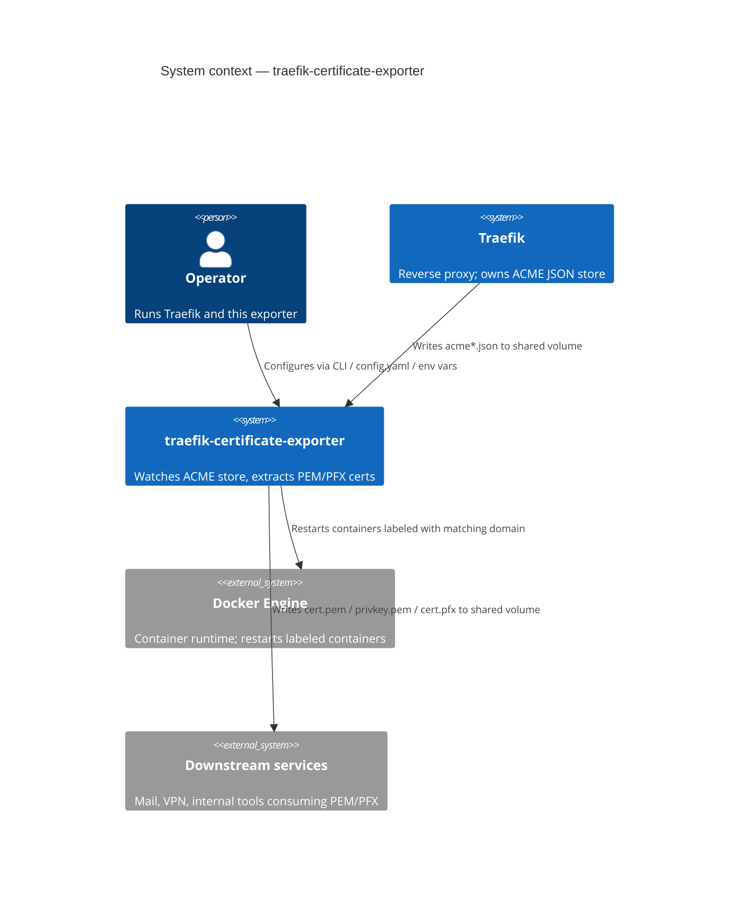
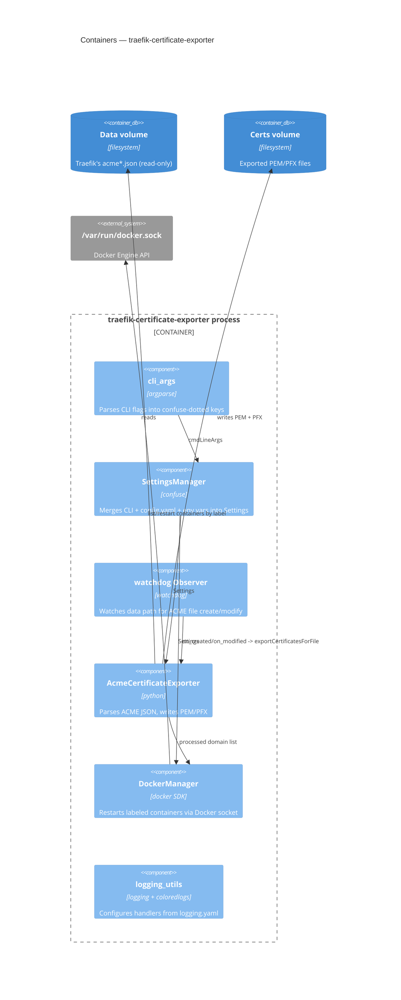
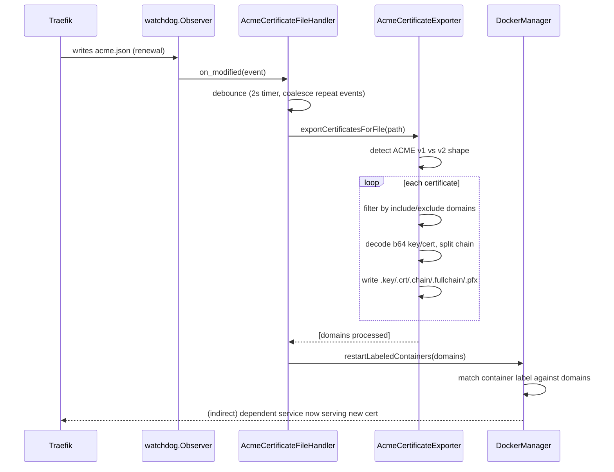
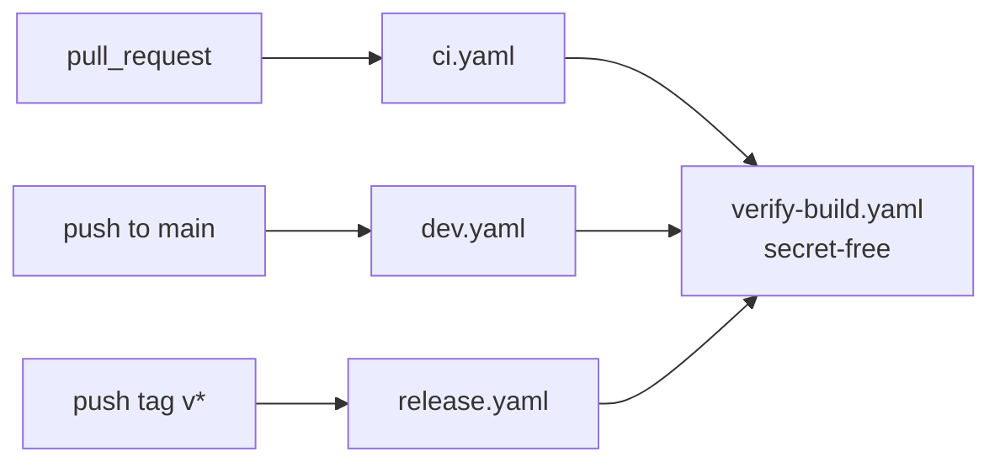
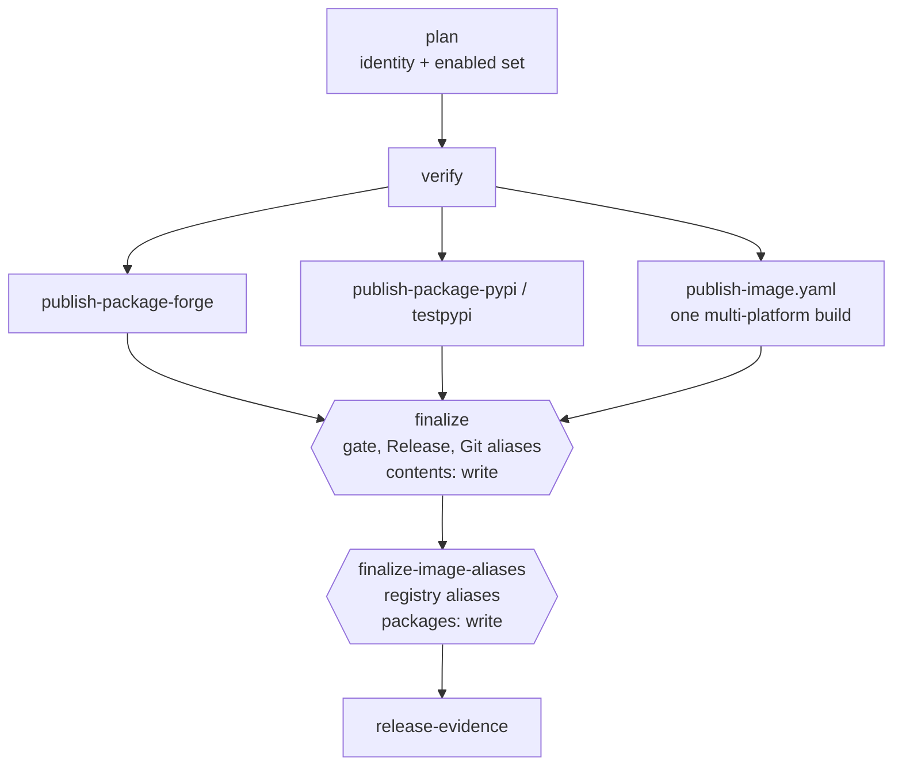

# Architecture — traefik-certificate-exporter

> Reverse-engineered from the current codebase (v0.1.3) per `l3io-arch-review` Mode A. See
> [the PRD](../_bmad-output/planning-artifacts/prds/prd-traefik-certificate-exporter-2026-08-30/prd.md) for requirements and the [review report](../_bmad-output/implementation-artifacts/review-report.md)
> for the audit that fed the ADRs and backlog referenced below. A companion
> [ARCHITECTURE-SPINE.md](../_bmad-output/planning-artifacts/architecture/architecture-traefik-certificate-exporter-2026-08-30/ARCHITECTURE-SPINE.md)
> exists as the canonical `bmad-architecture` planning artifact (terse AD-n invariants); this
> document is the fuller, diagram-first developer-facing rendering.

## 1. Context (C4 level 1)

## 2. Containers (C4 level 2)

## 3. Key flow — file change to restarted container

## 4. Deployment view

- **Distribution:** PyPI package (`pip install traefik-certificate-exporter`) or a Docker
  image built on `ghcr.io/linuxserver/baseimage-alpine:3.19` (s6-overlay init, PUID/PGID
  privilege drop — see [ADR-0002](adr/0002-container-base-image-and-privilege-model.md)).
- **Runtime:** single long-lived process per data path; no clustering, no leader election.
- **External dependencies at runtime:** filesystem (data + output volumes, read-only /
  read-write respectively), optionally `/var/run/docker.sock` if container restarts are enabled.

## 5. Known architectural gaps (tracked, not yet fixed)

See [PRD §6](../_bmad-output/planning-artifacts/prds/prd-traefik-certificate-exporter-2026-08-30/prd.md#6-fix--upgrade--enhancement-backlog) for the full, severity-ordered
backlog. The items with direct architectural shape impact:

- No observability surface (no metrics/health endpoint) — the system is a black box between
  log lines.

Two items listed here were closed and the list was not updated, which is how a "known gaps"
section stops being read. The dependency/build-artifact parity gap closed with
[ADR-0004](adr/0004-dependency-build-artifact-parity.md) in E007 — the image is built from the
locked set. "CI cannot build or publish either artifact" closed in E008: see §7 below.

## 6. Recorded decisions

| ADR | Decision | Spine invariant |
|---|---|---|
| [0001](adr/0001-python-dependency-management-poetry.md) | Poetry for dependency/environment management | [AD-1](../_bmad-output/planning-artifacts/architecture/architecture-traefik-certificate-exporter-2026-08-30/ARCHITECTURE-SPINE.md#ad-1--poetry-is-the-single-dependency-source) |
| [0002](adr/0002-container-base-image-and-privilege-model.md) | linuxserver.io base image + PUID/PGID privilege model | [AD-2](../_bmad-output/planning-artifacts/architecture/architecture-traefik-certificate-exporter-2026-08-30/ARCHITECTURE-SPINE.md#ad-2--container-base-image-and-privilege-model) |
| [0003](adr/0003-logging-stack-and-secret-redaction.md) | Logging stack and secret-redaction policy | [AD-3](../_bmad-output/planning-artifacts/architecture/architecture-traefik-certificate-exporter-2026-08-30/ARCHITECTURE-SPINE.md#ad-3--logging-structured-file-output-secrets-never-logged) |
| [0004](adr/0004-dependency-build-artifact-parity.md) | Docker image built from the locked dependency set | [AD-4](../_bmad-output/planning-artifacts/architecture/architecture-traefik-certificate-exporter-2026-08-30/ARCHITECTURE-SPINE.md#ad-4--docker-image-built-from-the-locked-dependency-set) |
| [0005](adr/0005-ci-reusable-workflow-wiring.md) | CI reusable-workflow wiring (superseded by 0007) | [AD-5](../_bmad-output/planning-artifacts/architecture/architecture-traefik-certificate-exporter-2026-08-30/ARCHITECTURE-SPINE.md#ad-5--one-ci-pipeline-three-runners-no-act-branching) |
| [0006](adr/0006-release-version-transaction.md) | The guarded release-version transaction; identity vs. its artifacts | — |
| [0007](adr/0007-pr-verification-topology.md) | PR-verification topology: thin event adapters, one secret-free verifier | — |
| [0008](adr/0008-exact-wheel-image-provenance.md) | Exact-wheel provenance from the verified bundle into the image | — |
| [0009](adr/0009-action-pin-policy.md) | Action pin policy: floating major by default, reviewed SHA for credential handlers | — |
| [0010](adr/0010-forge-release-mechanism.md) | Forge Release creation through one multi-platform action | — |
| [0011](adr/0011-publication-matrix-and-finalizer-aggregation.md) | Channel decides the destination set; how the finalizer reads a skipped job | — |
| [0012](adr/0012-image-metadata-action.md) | The image metadata action, verified at the tag this repository pins | — |

The ADR is the durable, full-rationale record (Context/Options/Decision/Consequences); the
spine's AD-n block is the terse, enforceable restatement `bmad-architecture`-driven work
checks against. Neither supersedes the other — update both if a decision changes.

## 7. Delivery topology (E008)

Five workflow files, two of them reusable. `ci.yaml` and `dev.yaml` and `release.yaml` own
events; `verify-build.yaml` and `publish-image.yaml` are called and own none. That partition is
asserted by `test_the_workflow_topology_is_a_partition_of_reusable_files_and_event_owners`, so
this diagram cannot quietly stop being true.

One verifier runs for every event. It is secret-free by construction
([ADR-0007](adr/0007-pr-verification-topology.md) invariant 2) and no caller may hand it a
credential; everything holding a credential sits downstream of it.

The two publishing channels share a shape: decide identity, verify, fan out to the enabled
destinations, refuse unless every enabled one delivered, then attach names. Only the last stage
holds the grants [ADR-0006](adr/0006-release-version-transaction.md) governs, and in the stable
channel it is split in two so that ref authority and registry authority are never held together.

`dev.yaml` is the same graph with one finalization job (`finalize-dev-alias`), no Release, and
Docker Hub never enabled — the channel decides the destination set
([ADR-0011](adr/0011-publication-matrix-and-finalizer-aggregation.md)).

Three properties are worth stating because they are the ones the guards spend most of their
effort on:

- **The verifier is upstream of every credential.** Every publisher revalidates the verified
  bundle before it logs in or uploads (CI-AR36).
- **Only a registered finalizer moves a mutable name.** `RELEASE_FINALIZER_JOBS` holds
  `(workflow, job)` pairs; anything else that writes a ref, creates a Release or moves a registry
  alias fails the suite — composite actions included, since their steps run with the calling
  job's authority.
- **Ordering comes from the Git tag set, read where the write happens.** Never from a registry,
  and never carried across a job boundary.
