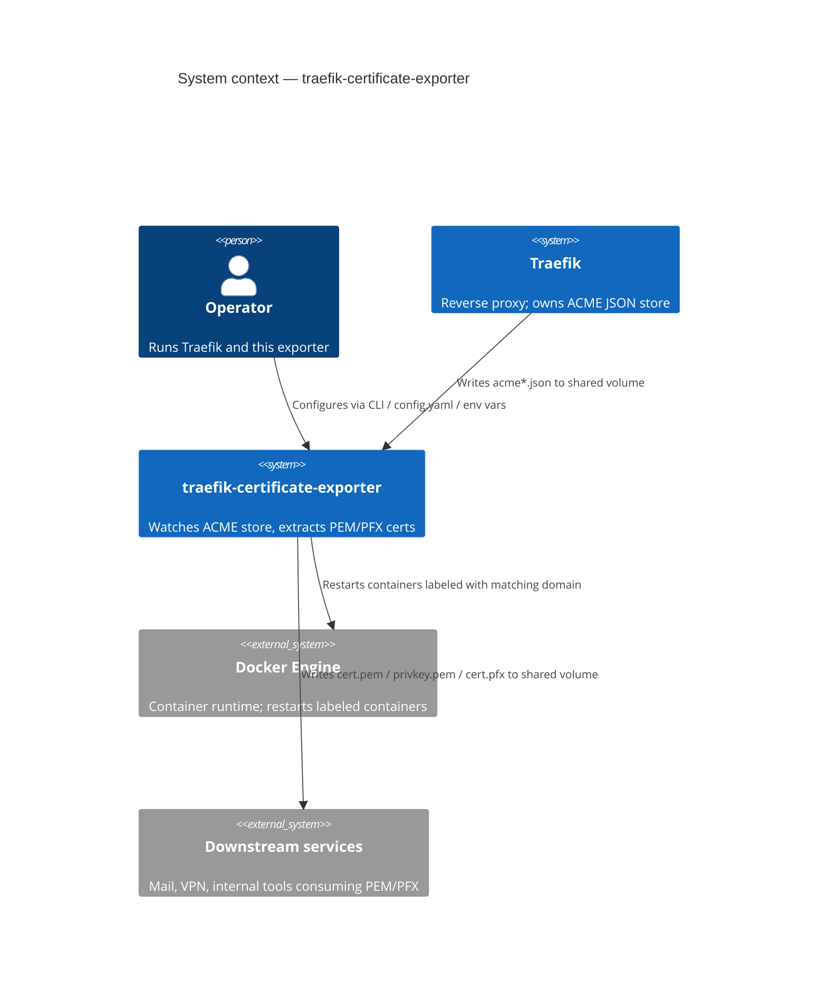
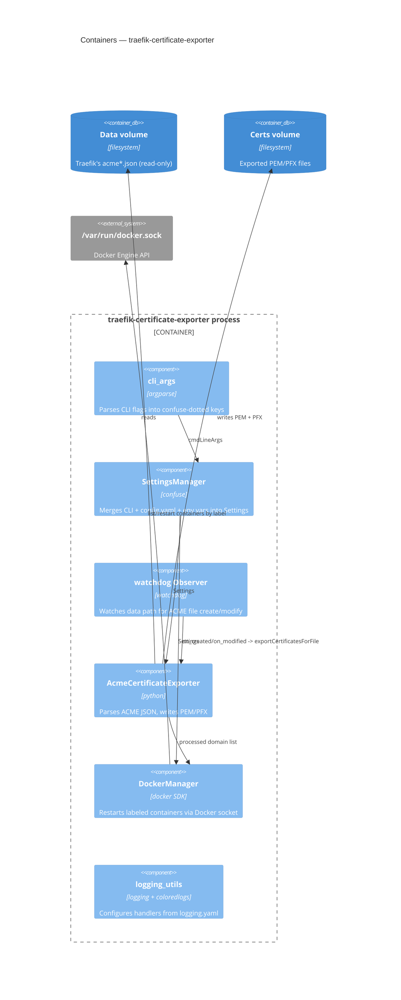
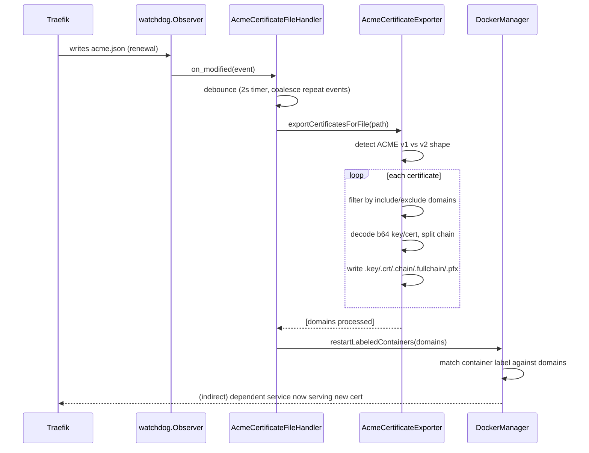

# Architecture — traefik-certificate-exporter

> Reverse-engineered from the current codebase (v0.1.3) per `l3io-arch-review` Mode A. See
> [the PRD](../_bmad-output/planning-artifacts/prds/prd-traefik-certificate-exporter-2026-08-30/prd.md) for requirements and the [review report](../_bmad-output/implementation-artifacts/review-report.md)
> for the audit that fed the ADRs and backlog referenced below. A companion
> [ARCHITECTURE-SPINE.md](../_bmad-output/planning-artifacts/architecture/architecture-traefik-certificate-exporter-2026-08-30/ARCHITECTURE-SPINE.md)
> exists as the canonical `bmad-architecture` planning artifact (terse AD-n invariants); this
> document is the fuller, diagram-first developer-facing rendering.

## 1. Context (C4 level 1)

## 2. Containers (C4 level 2)

## 3. Key flow — file change to restarted container

## 4. Deployment view

- **Distribution:** PyPI package (`pip install traefik-certificate-exporter`) or a Docker
  image built on `ghcr.io/linuxserver/baseimage-alpine:3.19` (s6-overlay init, PUID/PGID
  privilege drop — see [ADR-0002](adr/0002-container-base-image-and-privilege-model.md)).
- **Runtime:** single long-lived process per data path; no clustering, no leader election.
- **External dependencies at runtime:** filesystem (data + output volumes, read-only /
  read-write respectively), optionally `/var/run/docker.sock` if container restarts are enabled.

## 5. Known architectural gaps (tracked, not yet fixed)

See [PRD §6](../_bmad-output/planning-artifacts/prds/prd-traefik-certificate-exporter-2026-08-30/prd.md#6-fix--upgrade--enhancement-backlog) for the full, severity-ordered
backlog. The items with direct architectural shape impact:

- No observability surface (no metrics/health endpoint) — the system is a black box between
  log lines.
- Dependency/build-artifact parity gap between `pyproject.toml`/`poetry.lock` and the Docker
  image's hand-maintained `pip install` list ([ADR-0004](adr/0004-dependency-build-artifact-parity.md)).
- CI cannot currently build or publish either artifact ([ADR-0005](adr/0005-ci-reusable-workflow-wiring.md)).

## 6. Recorded decisions

| ADR | Decision | Spine invariant |
|---|---|---|
| [0001](adr/0001-python-dependency-management-poetry.md) | Poetry for dependency/environment management | [AD-1](../_bmad-output/planning-artifacts/architecture/architecture-traefik-certificate-exporter-2026-08-30/ARCHITECTURE-SPINE.md#ad-1--poetry-is-the-single-dependency-source) |
| [0002](adr/0002-container-base-image-and-privilege-model.md) | linuxserver.io base image + PUID/PGID privilege model | [AD-2](../_bmad-output/planning-artifacts/architecture/architecture-traefik-certificate-exporter-2026-08-30/ARCHITECTURE-SPINE.md#ad-2--container-base-image-and-privilege-model) |
| [0003](adr/0003-logging-stack-and-secret-redaction.md) | Logging stack and secret-redaction policy | [AD-3](../_bmad-output/planning-artifacts/architecture/architecture-traefik-certificate-exporter-2026-08-30/ARCHITECTURE-SPINE.md#ad-3--logging-structured-file-output-secrets-never-logged) |
| [0004](adr/0004-dependency-build-artifact-parity.md) | Docker image built from the locked dependency set | [AD-4](../_bmad-output/planning-artifacts/architecture/architecture-traefik-certificate-exporter-2026-08-30/ARCHITECTURE-SPINE.md#ad-4--docker-image-built-from-the-locked-dependency-set) |
| [0005](adr/0005-ci-reusable-workflow-wiring.md) | CI reusable-workflow wiring for `build.yaml` | [AD-5](../_bmad-output/planning-artifacts/architecture/architecture-traefik-certificate-exporter-2026-08-30/ARCHITECTURE-SPINE.md#ad-5--one-ci-pipeline-three-runners-no-act-branching) |

The ADR is the durable, full-rationale record (Context/Options/Decision/Consequences); the
spine's AD-n block is the terse, enforceable restatement `bmad-architecture`-driven work
checks against. Neither supersedes the other — update both if a decision changes.
